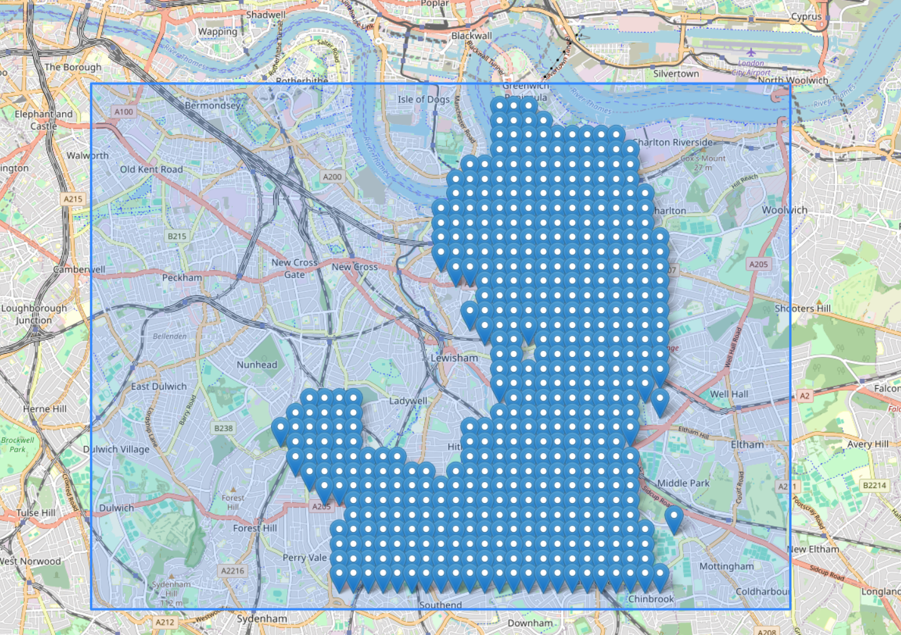

# A map of your video

This project aims to create an app which allows you to view a visuallisation of your video using markers on a map.

## Building

The project uses a [Wasm](https://webassembly.org/) library [ffmpegwasm](https://ffmpegwasm.netlify.app/) which needs to be built before running:

```bash
npm run build
```

If you have built the project you can run it using:

```bash
npm run preview
```

You can also make changes to the layout and look at them without building. Keep in mind that the site will not fully work without building the wasm library.

```bash
npm run dev
```

## Example


